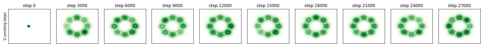
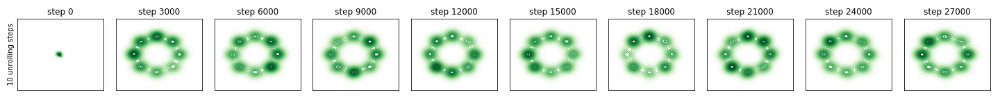
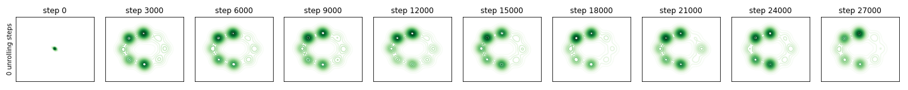
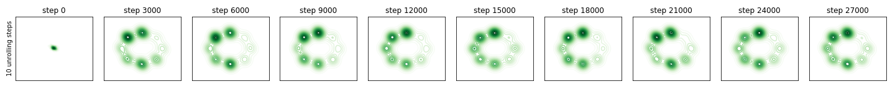
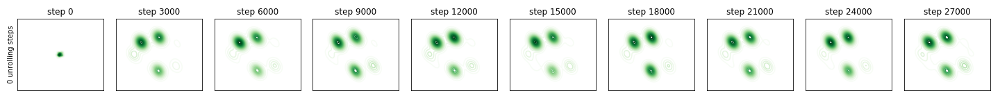
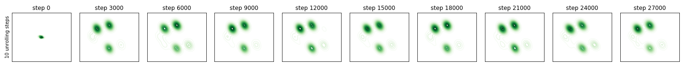
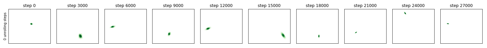
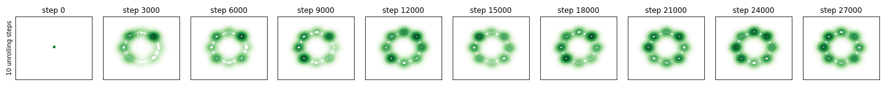

# pytorch-unrolled-gans

PyTorch implementation of [Unrolled Generative Adversarial Networks](https://arxiv.org/abs/1611.02163). The official tensorflow implementation is [here](https://github.com/poolio/unrolled_gan).

There is an issue posted in the official repo complaining that [**"Couldn't reproduce mode collapse without unrolling operation"**](https://github.com/poolio/unrolled_gan/issues/2). 
I also found this issue (especially when using `F.tanh` as activation function) when implemented this repo, and found it pretty interesting. 

Here are the corresponding results:

- unrolled steps = 0

 

- unrolled steps = 10

 

It's well-known that there are too many factors affect the GAN training, and 
I started to doubt whether the unrolled objective does help the GAN trainin or avoid mode collapse.
I try to make the data distribution harder by making the weight of the mixture gaussian non-uniform, so that the generator will be harder to cover all modes.

### Case 1:
- unrolled steps = 0

 

- unrolled steps = 10

 

Slight improvement can be observed. Glad to see that the unrolled objective does work at least in my experiement settings. :smile:

### Case 2 (failure case):
- unrolled steps = 0

 

- unrolled steps = 10

 

Larger improvement can be oberserved in the following experiments

## Other experiment settings

I found that *in this eperiments*, using `F.relu` (what the author used in the paper) results in larger gap:

### uniform mixture of gaussian

- unrolled steps = 0

 

- unrolled steps = 10

 

### non-uniform mixture of gaussian

- unrolled steps = 0

 

- unrolled steps = 10

 

## Requirements
- PyTorch 0.4.0
- matplotlib
- seaborn
- tqdm

## Reference
- [Unrolled Generative Adversarial Networks](https://arxiv.org/abs/1611.02163)
- [@poolio/unrolled_gan](https://github.com/poolio/unrolled_gan)
- [@devnag/pytorch-generative-adversarial-networks](https://github.com/devnag/pytorch-generative-adversarial-networks)
